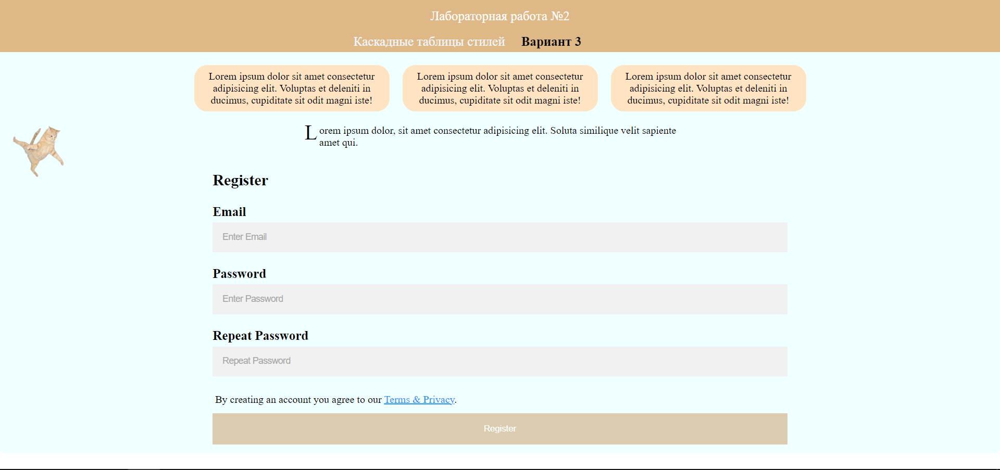

# Internet-технологии. Лабораторная работа №2. Каскадные таблицы стилей
### Вариант 3
КІУКІ-20-4 Ярослав Осьмуха

#### Головна сторінка

#### Абсолютне позиціонування

#### Форма регістрації

#### Відносне позиціонування

#### Inline Styles 
